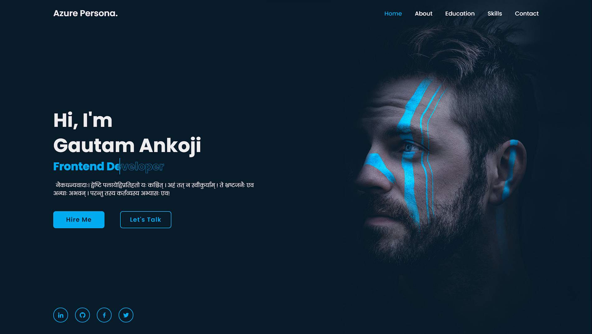

# Azure Persona Portfolio

Azure Persona is a responsive portfolio theme designed with a beautiful blue color scheme. This theme is perfect for showcasing your work and creating an impressive online presence. The theme incorporates a visually appealing and modern user interface to captivate your visitors.

## Preview

You can preview the theme by accessing the following link:

**[#1 Portfolio | Azure Persona](https://gautamankoji.github.io/static-web-pages/portfolios/Azure-Persona/index.html)**

Click on the link to experience the theme in action.

## Description

Azure Persona is a professionally designed portfolio theme that focuses on simplicity, elegance, and user experience. With its blue color palette and unsymmetrical grid pattern, it provides a unique and captivating visual experience to showcase your portfolio.

## Features

- **Responsive Design:** The theme is fully responsive, ensuring that your portfolio looks great on all devices, including desktops, tablets, and mobile phones.

- **Blue Color Scheme:** Azure Persona features a stylish blue color scheme that adds a touch of sophistication and professionalism to your portfolio.

- **Unsymmetrical Grid Pattern:** The unsymmetrical grid pattern enhances the visual appeal of the theme, creating an interesting and dynamic layout for your portfolio.

- **Easy Customization:** The theme is highly customizable, allowing you to personalize it according to your preferences. You can easily change colors, fonts, and other elements to match your branding.

- **Portfolio Showcase:** Azure Persona provides a dedicated section to showcase your portfolio items, allowing you to highlight your best work and attract potential clients or employers.

- **Contact Form:** The theme includes a contact form that enables visitors to get in touch with you directly, making it easy for potential clients or employers to reach out.

- **Social Media Integration:** Azure Persona seamlessly integrates with various social media platforms, allowing you to display your social media profiles and connect with your audience.

- **Cross-Browser Compatibility:** The theme is compatible with all modern web browsers, ensuring that your portfolio looks consistent and functions flawlessly across different platforms.

## Installation

To use the Azure Persona theme, follow these steps:

1. Download the theme files from the GitHub repository or any other source.

2. Extract the downloaded files to your desired location on your web server or local machine.

3. Customize the theme according to your preferences. You can modify the colors, fonts, images, and other elements to align with your branding.

4. Replace the sample content and images with your own portfolio items and information.

5. Test the theme thoroughly to ensure that all features and functionalities are working as expected.

6. Deploy the theme to your production environment or web hosting provider to make it accessible to the public.

## Credits

The Azure Persona theme incorporates the following resources:

- [Boxicons](https://boxicons.com/)
- [Unsplash](https://unsplash.com)
- [Bootstrap](https://getbootstrap.com)
- [Font Awesome](https://fontawesome.com)

Please make sure to review and comply with the licensing terms and requirements of these resources when using the Azure Persona theme.

## Support

If you encounter any issues or have any questions or suggestions regarding the Azure Persona theme, please feel free to contact our support team at [support@example.com](gautamankoji@gmail.com.com). We are here to assist you and ensure that you have a smooth experience with the theme.

## License

The Azure Persona theme is released under the [MIT License](LICENSE). You are free to modify and use the theme for personal and commercial projects. However, please note that you are responsible for ensuring compliance with any third-party resources or dependencies used in conjunction with the theme.

## Acknowledgements

We would like to express our gratitude to the open-source community for their contributions and the resources that make the Azure Persona theme possible. Thank you to all the developers, designers, and individuals who have helped create and enhance the tools and frameworks that empower us to build beautiful websites and portfolios.
